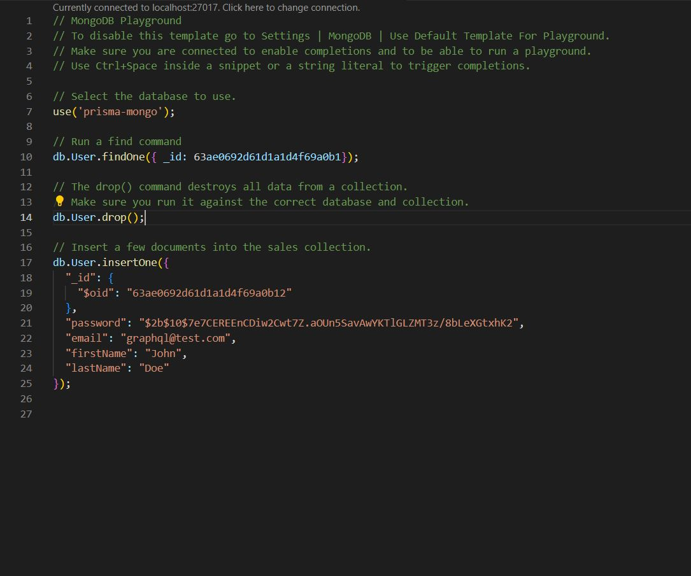

## NX Monorepo Simple Demo Final


# 1. launch backend server and mock db server

(\* if we are going to use mongo db instead of mock db, then go step 3 to setup mongo db first)

## Better don't run under vscode terminal

```bash
$ yarn mock-backend
```

# 2. launch front end (rect / angular)

run angular client

```bash
$ yarn start:angular
```

or run next client

```bash
$ yarn start:nextjs

```

# 3. auth db

# install/setup mongo db and redis server for backend (Only when we want to use mongo db instead of mock db)


### After launch mongo db instance, once new data created/signup, record should show in mongodb extension in vscode


### Mongo playground



```bash
$ docker-compose build
$ docker-compose up -d
```

# config ORM to connect to mongo db

```bash
## if prisma.user not found , run following command to recreate prisma client after setup mongo db
$ npx prisma generate
```

# set up config to connect to mock/mongo db

# update .env in root path

.env

## After config db, rerun yarn mock-backend, should shows in backend microservice running logs

### mongo db log


### mockdb log


```bash
# mongo database

DB='mongo'
users.mongo.repository

# local mock db

DB=''
authdb: users.mockdb.repository.ts
```

# 4. user / formfields db

```bash
# form fields db (json server)
# http://localhost:3000
resource db: db.json

# user db (json graphql server)
# http://localhost:5000
graphql db: db.js
```

# 5. test

## 5.1 unit tests


```bash

# test next/angular

$ yarn test:client

# test api.gateway/auth.microservice/user.microservice

$ yarn test:server
```

## 5.2 e2e tests (launch/setup xserver first if using WSL2/windows, also need to launch backend service before run cypress test)

### Launch xserver on windows


### Nextjs client e2e (app.cy.ts, don't run other test case which belongs to components test, it will fail under e2e tests)


### Angular client e2e (app.cy.ts, don't run other test case which belongs to components test, it will fail under e2e tests)


```bash
## make suer xserver is available and running

##Launch the backend service before test
$ yarn mock-backend

## nextjs client (Headless)
$ yarn test:e2e:nextjs
# then choose app.cy.ts

## watching for Changes (Headed Mode)
$ test:e2e:nextjs-watch

## angular client (Headless)
$ yarn test:e2e:angular
# then choose app.cy.ts
## watching for Changes (Headed Mode)
$ test:e2e:angular-watch
```

## 5.3 component test


```bash
## nextjs client component test
$ yarn test:component:nextjs
## watching for Changes (Headed Mode)
$ yarn test:component:nextjs-watch

## angular client component test
$ yarn test:component:angular
## watching for Changes (Headed Mode)
$ yarn test:component:angular-watch
```

# 6. storybook

```bash
## nextjs client

$ yarn test:storybook:nextjs

## angular client

$ yarn test:storybook:angular

```

Angular Client Storybook


Nextjs Client Storybook


# 7. [ TODO ITEM ]

## 1. Dockerize

## 2. Apply Nginx as web server

## 3. Change styling to TailWind css or styled-components

## 4. CI/CD Pipeline

//////////////////////////////////////////////////////

# Setup for cypress component project

```bash
$ nx g @nrwl/react:cypress-component-configuration --project=nextjs-client

$ nx g @nrwl/angular:cypress-component-configuration --project=angular-client
```

## Json GraphQL Server Playground


## All other sript that related

```bash
## start user.microservice
$ yarn backend:user

## start auth.microservice
$ yarn backend:auth

## start api.microservice
$ yarn backend:api

## start json server
$ yarn mockserver:json

## start json graphql server
$ yarn mockserver:graphql

## start all backend service
$ yarn mockserver

## start all backend service and mock db server
$ yarn mock-backend

## start angular-client
$ yarn start:angular

## start nextjs-client
$ yarn start:nextjs

```

## NX Server

[NX Server](./doc/SERVER.md)

## NX Client

[NX Client](./doc/CLIENT.md)

## Angular Client

[Angular Client](./doc/angular-client.md)

## Nextjs Client

[Nextjs Client](./doc/nextjs-client.md)

## Nestjs Microservices

[Nestjs Microservices](./doc/nestjs-server.md)
