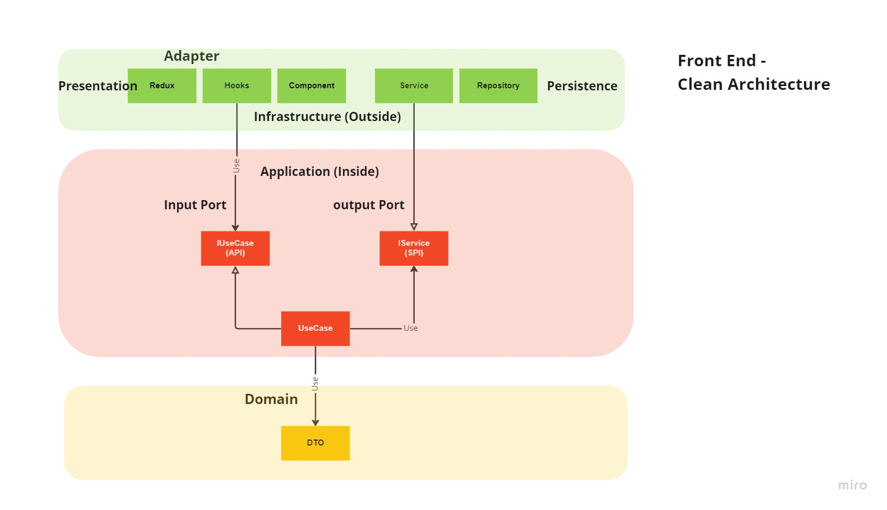
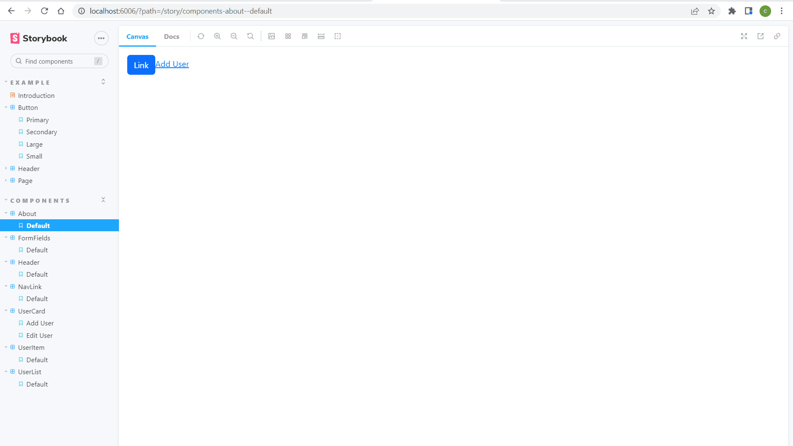
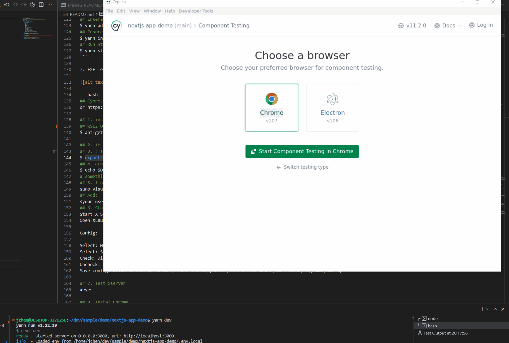
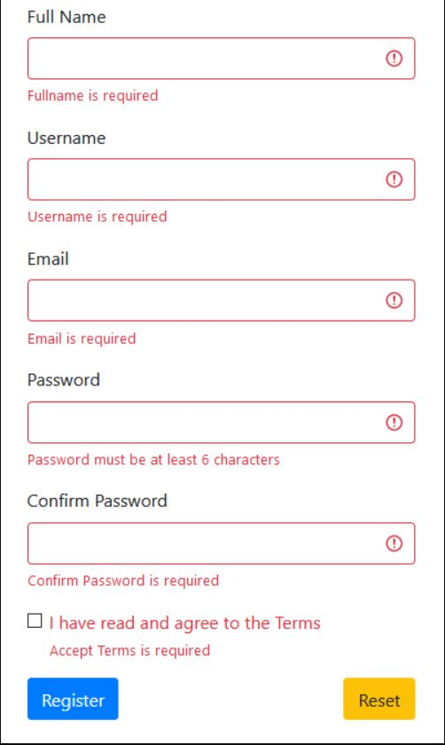
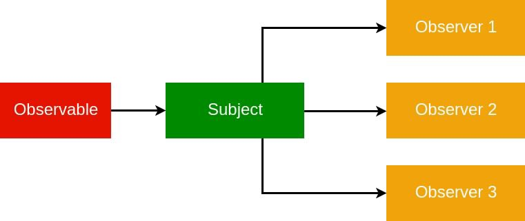

## Clean Architechture Front End Demo

NX Nextjs Project
$ nx g @nrwl/next:app nextjs-demo



- Domain - Entity, DTO
- Application - UseCase, Interfaces (API, SPI)
- Infrastructure - Adapter(Redux/Hooks), DB, Presentation, Service, Pages

## Demo Project - Tech Stack

- [x] Clean Architechture ( DDD / Domain, Application, Infrastructure)
- [x] Next - React Framework ( Routing, SSG, SSR)
- [x] ESLint / Prettier - Linting and Formatter
- [x] GitHooks - Hooks are programs you can place in a hooks directory to trigger actions at certain points in git's execution.
- [x] VS Code Config - Customize VS Code Settings
- [x] Storybook - A frontend workshop for building UI components and pages in isolation.
- [x] Testing Library/Jest - A very light-weight solution for testing React components.
- [x] Cypress - E2E test framework
- [x] Plop - Generates code when you want, how you want, and can be changed whenever you want
- [x] Bootstrap/Tailwind - Powerful, extensible, and feature-packed frontend toolkit
- [x] React Hooks Form / Yup - Performant, flexible and extensible forms with easy-to-use validation, dynamic fields/validation
- [x] State Management - Redux/Saga/React Hooks
- [x] DI - Inversifyjs
- [x] Mutation - immutability-helper
- [x] Reactive Extensions Library - RxJS

## NX

- What is Monorepo?
  Single Git Repository holds source code of multiple applications and libraries.

- Why to use Monorepo?Permalink
  Monorepo in organization helps you to get below benefits:

1. Shared Code: Reuse code validation, tooling code, and libraries code in applications in a single repository.
2. Atomic Changes: Change the button component in the shared library and update the application that uses that button in the same commit.
3. Developer Mobility: Developers can easily contribute to any applications or libraries by just going to one source code repository.

```bash
## install the Nx CLI
$ npm install nx -g

## create our monorepo
$ npx create-nx-workspace@latest --packageManager=yarn
## choose nextjs
## repo: nx-monorepo-demo
## application: client
## choose css

## install storybook plugin
$ yarn add --dev @nrwl/storybook
## config storybook
$ nx g @nrwl/storybook:configuration client --tsConfiguration=true
## run dev
$ yarn start
## run jest tests
$ yarn test
## run cypress e2e test
$ yarn test:e2e
## run storybook
$ yarn storybook
## bootstrap
$ yarn add bootstrap
## install husky
$ yarn add -D husky
## to enable Husky run
$ yarn husky install
## lint-staged ??
$ yarn add -D lint-staged
##
$ yarn add -D cross-env
## 14 react hook form
## 15 redux
$ nx generate @nrwl/react:redux --name=user --project=client
## 17 Inversifyjs
## 8. Unit Testing
$ yarn add browserify-fs

## 19. Inversifyjs
```

## Next.js

- Routing Pages:
  1. The files inside the pages directory can be used to define most common patterns.
  2. API routes provide a solution to build your API with Next.js.
- Pre-rendering, both static generation (SSG) and server-side rendering (SSR) are supported on a per-page basis
  1. getStaticProps(): A method that tells the Next component to populate props and render into a static HTML page at build time. HTML is generated on build-time and reused on each request.
  2. getServerSideProps(): A method that tells the Next component to populate the props and render into a static HTML page at run time. HTML is generated on each request.
- Automatic code splitting for faster page loads
- Built-in CSS and Sass support
- Development environment with Fast Refresh support
- Layout Component
- Image Optimization
- Static File Serving

1. Project setup

```bash
## Create a new project
$ npx create-next-app --ts nextjs-demo
## Install Package
$ yarn install
## Test
$ yarn dev
## Build
$ yarn build
## Will tell other uses of the project which version of Node is used
$ touch .nvmrc
## Will tell other users of the project which package manager is used
$ touch .npmrc

```

2. ESLint

```bash
## Check linting
$ yarn lint

```

3. Prettier

```bash
## Setup Prettier
yarn add -D prettier
## Setup prettier rules
$ touch .prettierrc
## Setup prettier ignore rules
$ touch .prettierrignore
```

4. Git Hooks

```bash
## Install Husky
$ yarn add -D husky
## Create a .husky directory in your project
$ npx husky install
## Check lint before git commit
$ npx husky add .husky/pre-commit "yarn lint"
##
$ yarn add -D @commitlint/config-conventional @commitlint/cli
```

5. VS Code config

```bash
## Create a directory in the root of your project called .vscode
$ touch .vscode/settings.json
## Setup for debug
$ touch .vscode/launch.json
## Create env support
$ yarn add -D cross-env
```

6. Storybook

- Develop UIs that are more durable
- Test UIs with less effort and no flakes
- Document UI for your team to reuse
- Share how the UI actually works
- Automate UI workflows



```bash
## Install Storybook, prompt about the eslintPlugin, choose "yes"
$ npx sb init --builder webpack5

## Install storybook-addon-next using yarn:
$ yarn add --dev storybook-addon-next
$ yarn add -D storybook-addon-next-router
## Log addon
$ yarn add --dev @storybook/addon-console @storybook/addon-actions
## Interactions addon
$ yarn add -D @storybook/testing-library @storybook/jest @storybook/addon-interactions
## Ensure that the webpack5 is installed
$ yarn install
## Run Storybook
$ yarn storybook
```

8. Unit Testing

```bash
## Testing Library / Jest (Unit Testing)
$ yarn add -D jest jest-environment-jsdom @testing-library/react @testing-library/react-hooks @testing-library/jest-dom
$ yarn add -D jest-mock-extended
$ yarn add -D redux-saga-test-plan
$ yarn add -D jest-fetch-mock
$ yarn add -D node-mocks-http

## Redux testing
$ yarn add -D jest jest-environment-jsdom @testing-library/react @testing-library/jest-dom
$ yarn add -D @types/jest
$ yarn add -D redux-mock-store @types/redux-mock-store
```

9. Component Test




10. E2E Testing


```bash
## Cypress (E2E) https://gist.github.com/pjobson/6b9fb926c59f58aa73d4efa10fe13654
or https://shouv.medium.com/how-to-run-cypress-on-wsl2-989b83795fb6

## 1. install the prerequisite packages.
## WSL2 Ubuntu
$ apt-get install libgtk2.0-0 libgtk-3-0 libgbm-dev libnotify-dev libgconf-2-4 libnss3 libxss1 libasound2 libxtst6 xauth xvfb

## 2. if its ubuntu/wsl2, need to Download and install vcxsrv: https://sourceforge.net/projects/vcxsrv/
## 3. # set DISPLAY variable to the IP automatically assigned to WSL2, add it to ~/.bashrc file
$ export DISPLAY=$(cat /etc/resolv.conf | grep nameserver | awk '{print $2; exit;}'):0.0
## 4. echo $DISPLAY
$ echo $DISPLAY
# something like 192.168.64.1:0.0
## 5. linux user needs to be granted access to dbus without a password.
sudo visudo -f /etc/sudoers.d/dbus
## Add:
<your username> ALL = (root) NOPASSWD: /etc/init.d/dbus
## 6. Start X Server
Start X Server
Open XLaunch from start menu.

Config:

Select: Multiple Windows (default)
Select: Start no client (default)
Check: Disable access control
Uncheck: Native opengl
Save configuration on startup folder, location: %AppData%\Microsoft\Windows\Start Menu\Programs\Startup

## 7. Test xserver
xeyes

## 8. Instal Chrome
## Dependencies, make sure you’re up to date first:
$ sudo apt update && sudo apt -y upgrade && sudo apt -y autoremove
## Download and install Chrome:
$ wget https://dl.google.com/linux/direct/google-chrome-stable_current_amd64.deb
$ sudo apt -y install ./google-chrome-stable_current_amd64.deb
## Check that it’s installed ok:
$ google-chrome --version

## 9. Install Cypress
$ yarn add -D cypress

## Eslint plugin for cypress
$ yarn add -D eslint-plugin-cypress
$ yarn add -D cypress-axe
## Lauch cypress and test
$ yarn cypress:open
```

11. Plop

```bash
## plop
$ yarn add -D plop
## Creating a Component Template
$ touch /components/templates/base
```

12. Bootstrap

```bash
$ yarn add -D bootstrap
```

13. Tailwind Css/MUI

- Rapidly build modern websites without ever leaving your HTML

```bash
## Install Tailwind css
$ yarn add -D tailwindcss postcss autoprefixer  @tailwindcss/forms react-icons

$ npx tailwindcss init -p

## Install MUI
$ yarn add -D @material-ui/core

$ yarn add -D @material-ui/icons
```

14. React Hook Form



```bash
## Install react hook form
$ yarn add react-hook-form @hookform/resolvers
$ yarn add -D @types/react-hook-form

## Install react hook form schema
$ yarn add -D react-hook-form-jsonschema

## yup validator
$ yarn add yup

## JSON schema for yup validator
$ yarn add -D json-yup
$ yarn add -D schema-to-yup
```

15. Redux / Saga / React Hooks

    - Redux -

    1. Redux helps you write applications that behave consistently
    2. Centralizing your application's state and logic
       The Redux DevTools make it easy to trace
    3. Redux works with any UI layer

    - Sagas -

    1. Redux Saga is a library that aims to make side effects easier to work with.
    2. Handle multiple async requests.
    3. Are implemented using Generator functions.


```bash
##Install Redux
$ yarn add -D react-redux
$ yarn add -D @reduxjs/toolkit

## install redux/saga
$ yarn add -D redux-saga

## install redux/logger
$ yarn add -D redux-logger
$ yarn add -D @types/redux-logger
## installl reduxt/devtools-extension
$ yarn add -D redux-devtools-extension
```

16. Mutation support

```bash
$ yarn add -D immutability-helper
```

17. DI Support - Inversifyjs

```bash
$ yarn add -D inversify reflect-metadata
```

18. Rxjs



- Observables are streams, A stream is a sequence of data elements made available over time.
  Suppose that each element in the array occurred over time; that is, you don’t get all elements immediately, but rather one at a time.
  This can be described as a stream of values, or a sequence of events, or more relevantly, an observable.
- RxJS presents a lot of operators that facilitate coding (pipe, map, filter, tap)
- Emission debouncing - discarding emissions until a set amount of time passed after the last one and then return that last one.
- Emission replay -The data is being retrieved on multiple subscriptions yet it actually is only being requested once.
- Cancellation of subscriptions
- Error catching / Retry on error
- No callback hell

```bash
## 19. Install inversify
$ yarn add -D inversify reflect-metadata
## Install inversify support
$ yarn add -D @babel/core @babel/plugin-proposal-decorators babel-plugin-transform-typescript-metadata
$ yarn add -D babel-plugin-parameter-decorator
$ yarn add -D inversify-inject-decorators
## Add babel.config.js
## Update tsconfig.js
```

This is a [Next.js](https://nextjs.org/) project bootstrapped with [`create-next-app`](https://github.com/vercel/next.js/tree/canary/packages/create-next-app).

## Getting Started

First, run the development server:

```bash
npm run dev
# or
yarn dev

```

This is a [Next.js](https://nextjs.org/) project bootstrapped with [`create-next-app`](https://github.com/vercel/next.js/tree/canary/packages/create-next-app).

## Getting Started

First, run the development server:

```bash
npm run dev
# or
yarn dev
```

Open [http://localhost:3000](http://localhost:3000) with your browser to see the result.

You can start editing the page by modifying `pages/index.tsx`. The page auto-updates as you edit the file.

[API routes](https://nextjs.org/docs/api-routes/introduction) can be accessed on [http://localhost:3000/api/hello](http://localhost:3000/api/hello). This endpoint can be edited in `pages/api/hello.ts`.

The `pages/api` directory is mapped to `/api/*`. Files in this directory are treated as [API routes](https://nextjs.org/docs/api-routes/introduction) instead of React pages.

## Learn More

To learn more about Next.js, take a look at the following resources:

- [Next.js Documentation](https://nextjs.org/docs) - learn about Next.js features and API.
- [Learn Next.js](https://nextjs.org/learn) - an interactive Next.js tutorial.

You can check out [the Next.js GitHub repository](https://github.com/vercel/next.js/) - your feedback and contributions are welcome!

## Deploy on Vercel

The easiest way to deploy your Next.js app is to use the [Vercel Platform](https://vercel.com/new?utm_medium=default-template&filter=next.js&utm_source=create-next-app&utm_campaign=create-next-app-readme) from the creators of Next.js.

Check out our [Next.js deployment documentation](https://nextjs.org/docs/deployment) for more details.

[Back to README](../README.md)
