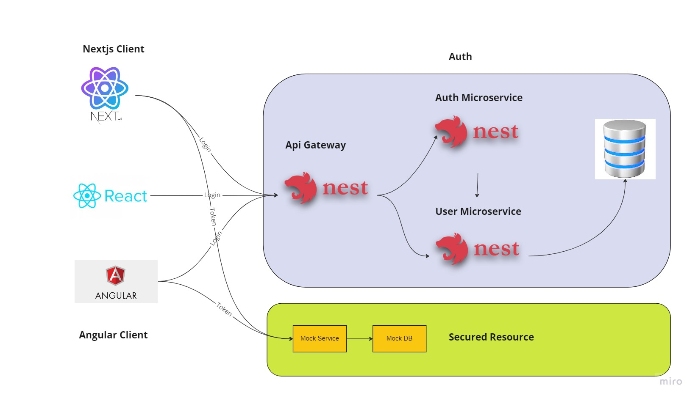
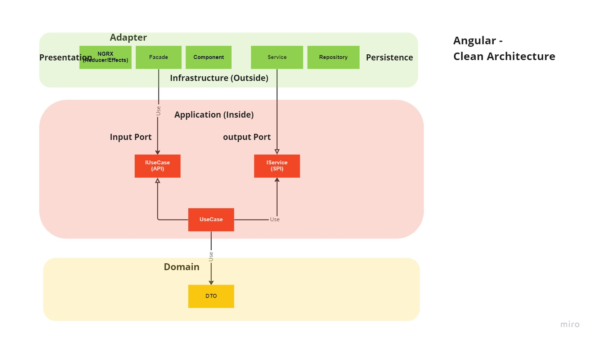
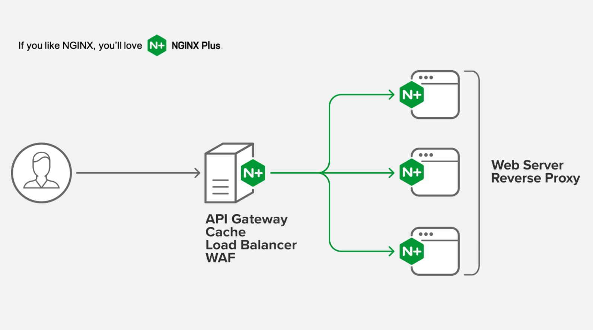
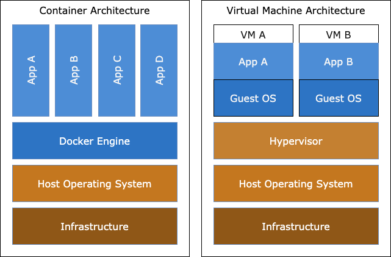
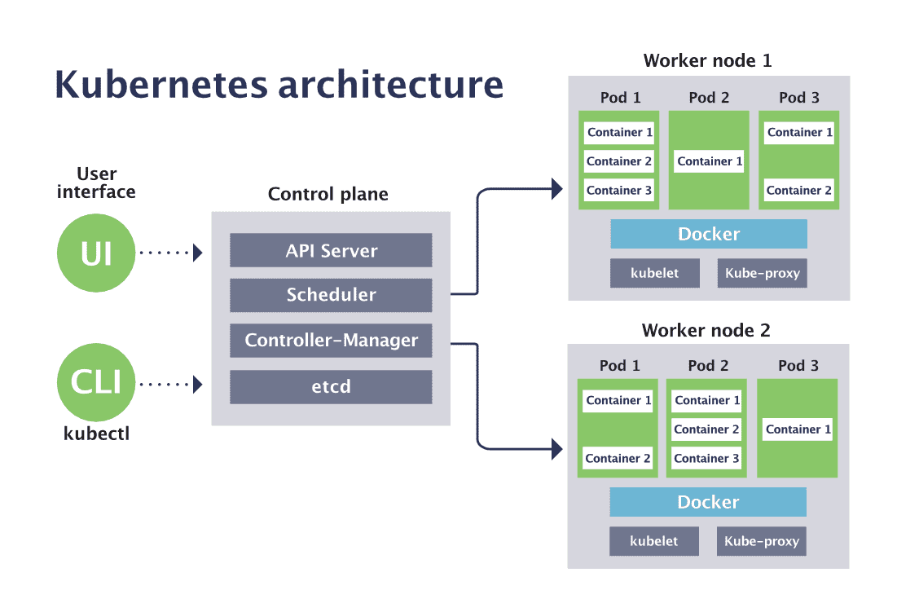

# NxMonorepoDemo

////////////////// Part3 ///////////////////////////////

## Authentication

- [x] Apollo GraphQL
- [x] Json-GraphQL-server
- [x] Auth Guard





```bash
## create mock server
$ yarn add json-graphql-server

$ yarn add graphql-tools apollo-angular @apollo/client graphql

## create graphql client
$ yarn add apollo-cache-inmemory apollo-angular-link-http apollo-link graphql-tag

## create auth component
$ npx nx g @nrwl/angular:component signup --project=angular-client --export --skip-import

$ npx nx g @nrwl/angular:component login --project=angular-client --export --skip-import

## alert message
$ yarn add ngx-toastr
$ yarn add @angular/animations
```

////////////////// Part2 ///////////////////////////////

# Angular in Clean Way Approach

- [x] NX MonoRepo
- [x] Clean Architecture
- [x] NGRX (Reducer, Effects, Logger)
- [x] Json-server
- [x] NGX-Formly (Dynamic Form and list)
- [x] Cypress - e2e test
- [x] Storybook - Component Test
- [x] RXJS - Reactive tools
- [x] Nginx - Web Server(Load Balancer)
- [x] TestBeb
- [x] Bootstrap

## Clean Architecture



## Angular

- ngOnChanges - triggers following the modification of @Input bound class members.
- ngOnInit fires once upon initialization of a component’s input-bound (@Input) properties
- ngDoCheck fires with every change detection cycle.
- ngAfterContentInit fires after the component’s content DOM initializes (loads for the first time).
- ngAfterContentChecked fires after every cycle of change detection targeting the content DOM.
- ngAfterViewInit fires once after the view DOM finishes initializing.
- ngAfterViewChecked fires after any change detection cycle targeting the component’s view.
- ngOnDestroy fires upon a component’s removal from the view and subsequent DOM.


## Run and Debug

1. start json-server
   $ yarn mockserver

2. start angular-client
   $ yarn start:angular
   http://localhost:4200


3. build angular-client
   $ yarn build:angular

4. test angular-client
   $ yarn test:angular

5. e2e test angular-client
   $ yarn test:e2e:angular
   or
6. e2e test with window
   $ yarn test:e2e:angular-debug

7. story book angular-client
   $ yarn test:storybook:angular

8. dockerize nx projects and nginx (load balancer)
   $ docker-compose build
   $ docker-compose up -d
   http://localhost:8080
   $ docker-compose stop

9. all other srcipts commands for this nx projects
   "angular": "nx serve angular-client",
   "build": "nx build",
   "build:angular": "nx build angular-client",
   "test:angular": "nx test angular-client",
   "test:e2e:nextjs": "nx run nextjs-client-e2e:e2e",
   "test:e2e:angular": "nx run angular-client-e2e:e2e",
   "test:e2e:angular-debug": "nx run angular-client-e2e:e2e --watch",
   "test:storybook:angular": "nx run angular-client:storybook",
   "mockserver": "json-server --watch db.json"

## NGRX (Reducer, Effects, Selector, Store, Action)


## Angular Facade

- only getting the data when available
- not sensitive to race conditions
- encapsulating data services/facades as we don’t need to know about their internals to use them
- treating the code the same regardless if it is asynchronous or not


```bash
# install angular cli
$ npm install -g @angular/cli

## Create nx angular application
$ nx g @nrwl/angular:app angular-client

## Create nx angular component
$ npx nx g @nrwl/angular:component home --project=angular-client --export

$ npx nx g @nrwl/angular:component navbar --project=angular-client --export

$ npx nx g @nrwl/angular:component userlist --project=angular-client --export

$ npx nx g @nrwl/angular:component usercard --project=angular-client --export

$ npx nx g @nrwl/angular:component jsonform --project=angular-client --export

# install bootstrap
$ yarn add bootstrap

# ngrx store
$ yarn add @ngrx/core @ngrx/store @ngrx/effects @ngrx/store-devtools @ngrx/router-store

# ngrx logger
$ yarn add -D ngrx-store-logger

# mock db
$ yarn add lowdb file-sync @types/lowdb
$ yarn add -D json-server

# ngx formly (json form)
$ yarn add -W @ngx-formly/schematics --ui-theme=bootstrap
$ yarn add -D @angular/forms @ngx-formly/core @ngx-formly/bootstrap

# ngrx test
$ yarn add -D jasmine-marbles @hirez_io/observer-spy jest-jasmine2 jest-mock-extended

## Storybook
$ nx g @nrwl/angular:storybook-configuration angular-client
# re-run
$ nx g @nrwl/angular:stories angular-client
## Add this line to angular-client/project.json so it supports bootstrap styles
"styles": ["node_modules/bootstrap/dist/css/bootstrap.min.css"],
```

# NGRX

- NgRx is a state management solution for Angular built on top of RxJS which adheres to the redux pattern.

- Store is RxJS powered global state management for Angular applications, inspired by Redux. Store is a controlled state container designed to help write performant, consistent applications on top of Angular.

////////////////// Part1 ///////////////////////////////

# NX

- Nx is a smart, fast and extensible build system with first class monorepo support and powerful integrations.

## Nx has two main goals:

- Speed up your existing workflow with minimum effort.
- Provide a first-rate developer experience no matter the size of the repo.


```bash
## install nx
$ yarn install -g nx
# or
$ npm i -g nx
## Create nx workspace
$ npx create-nx-workspace@latest --packageManager=yarn

## Create nx plugin
$ yarn add -D @nrwl/react
$ yarn add -D @nrwl/angular
$ yarn add -D @nrwl/nest
$ yarn add -D @nrwl/next
$ yarn add -D @nrwl/express

## Create nx application
$ nx g @nrwl/react:app react-client
$ nx g @nrwl/nest:app express-service

## nx test
$ nx test
## nx e2e
$ nx run react-client-e2e:e2e
## nx graph
$ nx graph
```


# Nginx (TODO)



- is a popular lightweight http server with many advanced capabilities

Reverse proxy server — As traffic to your app increases, the best approach to improve performance is to use Nginx as a reverse proxy server in front of the Node.js server to load balance traffic across the servers. This is the core use case of Nginx in Node.js applications

Stateless load balancing — This improves performance while reducing load on backend services by sending off client requests to be fulfilled by any server with access to the requested file

Cache static contents — Serving static content in a Node.js application and using Nginx as a reverse proxy server doubles the application performance to a maximum of 1,600 requests per second

Implement SSL/TLS and HTTP/2 — Given the recent shift from using SSL/TLS to secure user interactions in Node.js applications, Nginx also supports HTTP/2 connections

Performance tracking — You can keep real-time tabs on the overall performance of your Node.js application using the stats provided on Nginx’s live dashboards

Scalability — Depending on what assets you’re serving, you can take advantage of the full‑featured HTTP, TCP, and UDP load balancing in Nginx to scale up your Node.js application


```bash
# update ubuntu
$ sudo apt-get update
$ sudo apt-get upgrade

# install Nginx
$ sudo add-apt-repository ppa:nginx/stable
sudo apt-get update
sudo apt-get install -y nginx

# start nginx server
$ sudo service nginx start

# stop nginx server
$ sudo service nginx stop

# Test Nginx Webserver
http:localhost:80
```

# Docker

- Docker is an open source containerization platform.



```bash
Download Docker Desktop and install

$ sudo apt-get update
$ sudo apt install docker-compose

# docker compose build
$ docker-compose build

# or clear before build
$ docker-compose build --no-cache --force-rm

# docker compose mount
$ docker-compose up -d

visit client
http://localhost:4200/

visit service
http://localhost:4310/api

# docker compose stop
$ docker-compose stop
```

# Kubernetes

- Enter Kubernetes, a container orchestration system – a way to manage the lifecycle of containerized applications across an entire fleet.

- Pods A Kubernetes pod is a group of containers, and is the smallest unit that Kubernetes administers.
- Deployments Kubernetes deployments define the scale at which you want to run your application by letting you set the details of how you would like pods replicated on your Kubernetes nodes.
- Services A service is an abstraction over the pods
- Nodes A Kubernetes node manages and runs pods; it’s the machine (whether virtualized or physical) that performs the given work.
- The Kubernetes control plane is the main entry point for administrators and users to manage the various nodes
- Cluster A cluster is all of the above components put together as a single unit.



AWS deployment chain
Deploy node Application on AWS with Kubernetes
Deployment Approach:

- Uses AWS infrastructure which created by Terraform
- Kuberenetes deployment made manually using kops and kubelet.
- Create services called node.
- Node service includes with the docker image, which pull from the repo and deploy the image.


# Terraform

Terraform is an infrastructure as code tool that lets you define both cloud and on-prem resources in human-readable configuration files that you can version, reuse, and share. You can then use a consistent workflow to provision and manage all of your infrastructure throughout its lifecycle. Terraform can manage low-level components like compute, storage, and networking resources, as well as high-level components like DNS entries and SaaS features.


# ChatGPT

Optimizing Language Models for Dialogue - OpenAI


```bash
# kubectl - The Kubernetes command-line tool

## Install kubectl on Linux
## download latest
$ curl -LO "https://dl.k8s.io/release/$(curl -L -s https://dl.k8s.io/release/stable.txt)/bin/linux/amd64/kubectl"
## validate binary
$ curl -LO "https://dl.k8s.io/$(curl -L -s https://dl.k8s.io/release/stable.txt)/bin/linux/amd64/kubectl.sha256"
## Install kubectl
$ sudo apt-get update
$ sudo install -o root -g root -m 0755 kubectl /usr/local/bin/kubectl
## Test to ensure the version you installed is up-to-date:
$ kubectl version --client

# Check if minikube node is ready
$ kubectl get nodes

# minikube - minikube is local Kubernetes

# install the latest minikube stable release on x86-64 Linux using binary download
$ curl -LO https://storage.googleapis.com/minikube/releases/latest/minikube-linux-amd64

$ sudo install minikube-linux-amd64 /usr/local/bin/minikube

# Start your cluster
$ minikube start
# stop cluster
$ minikube stop
# delete cluster
$ minikube delete --all

# virtualbox - VirtualBox is a general-purpose full virtualizer for x86 hardware, targeted at server, desktop and embedded use.
$ sudo apt-get update
$ sudo apt-get install virtualbox
$ sudo apt-get install virtualbox—ext–pack

```

```bash
# 1. Create docker file
apps/express-service/Dockerfile

# 2. Start the kubernetes cluster with minikube
$ minikube start
$ minikube addons enable metrics-server
```


```bash
# 3. Check if minikube node is ready
$ kubectl get nodes

```


```bash

# 4. ran nx Build
$ nx build express-service

# 5. Configure environment to use minikube’s Docker daemon
$ minikube docker-env

# 6. Copy and run the "eval" command from the output
$ eval $(minikube -p minikube docker-env)

# 7. Build the docker images
$ docker build -f ./apps/express-service/Dockerfile . -t express-service

```


```bash

# 8. Check whether docker images has been created
$ docker images --format "table {{.ID}}\t{{.Tag}}\t{{.Repository}}"

```


```bash

# 9. Create manifest config files
apps/express-service/deployment.json
apps/express-service/service.json

# 10. Apply the configuration in deployment.json and service.json to a pod
$ kubectl apply -f apps/express-service/deployment.json
$ kubectl apply -f apps/express-service/service.json

# 11. Check if pods are running
$ kubectl get pods

# 12. Check if services are running
$ kubectl get services

```


```bash

# 13. Access services outside the node
$ minikube service express-service --url

```


```bash

# 14. http://127.0.0.1:xxxxx/api

# 15. minikube dashboard
$ minikube dashboard
```


<a href="https://nx.dev" target="_blank" rel="noreferrer"></a>

✨ **This workspace has been generated by [Nx, a Smart, fast and extensible build system.](https://nx.dev)** ✨

## Development server

Run `nx serve react-client` for a dev server. Navigate to http://localhost:4200/. The app will automatically reload if you change any of the source files.

## Understand this workspace

Run `nx graph` to see a diagram of the dependencies of the projects.

## Remote caching

Run `npx nx connect-to-nx-cloud` to enable [remote caching](https://nx.app) and make CI faster.

## Further help

Visit the [Nx Documentation](https://nx.dev) to learn more.

[Back to README](../README.md)
