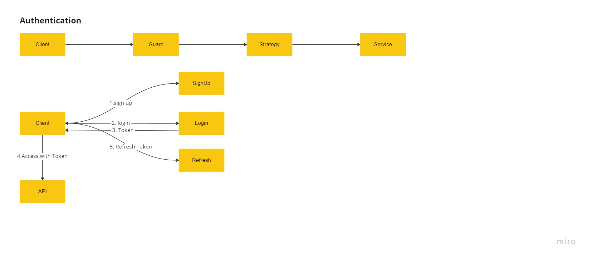

## Authentication

## Auth Demo


## Nest Guard and Strategy

## Lifecycle

In Nest.js, here is the order in which decorators get called :

- Middleware
- Guard
- ValidationPipe
- Controller route handler method

## AuthGuard

Lifecycle
To put it simply, it does :

- extends Guard
- pipe the options to the underlying passport strategy
- call the authorization logic of the underlying passport strategy
- finally call PassportStrategy's verify method (which, under the hood, calls validate on Nest.js PassportStrategy), allowing you to plug your own additional authorization logic

## Token-based Authentication

1. [Public] Register a new user account

2. [Local Protected] Sign in user and get access token/refresh token
   - Validate user => sign token
3. [Refresh Token Protected] Refresh the token and get access token/refresh token
   - Validate refresh token => validate user => decode refresh token => find user => sing token
4. [Access Token Protected] Auth test with tokens
   - Validate access token => validate user
5. [Access Token Protected] Logout and remove the access token/refresh token
   - Validate access token => validate user
6. [Public] Delete the user



```bash
## Authentication requirements
$ npm install --save @nestjs/passport passport passport-local
$ npm install --save-dev @types/passport-local

$ npm install --save @nestjs/jwt passport-jwt
$ npm install --save-dev @types/passport-jwt

$ npm i -S bcrypt
$ npm i -D @types/bcrypt
```

[Back to DDD](./DDD.md)
