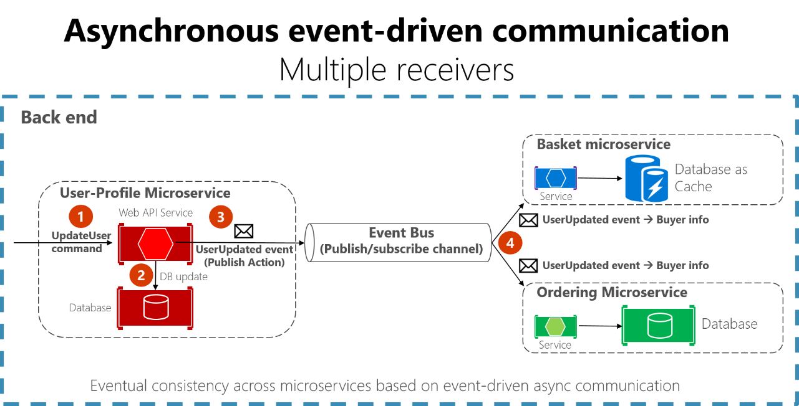
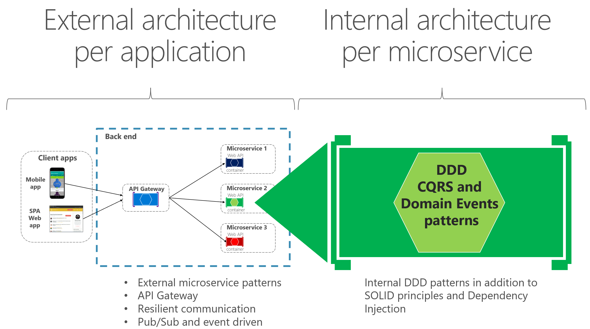
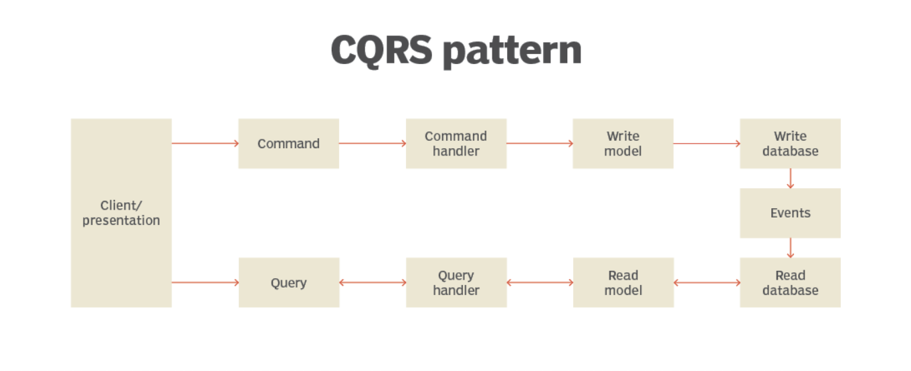
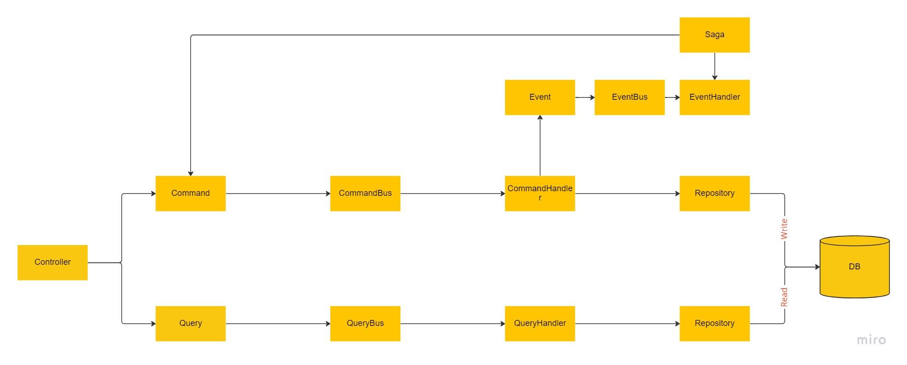
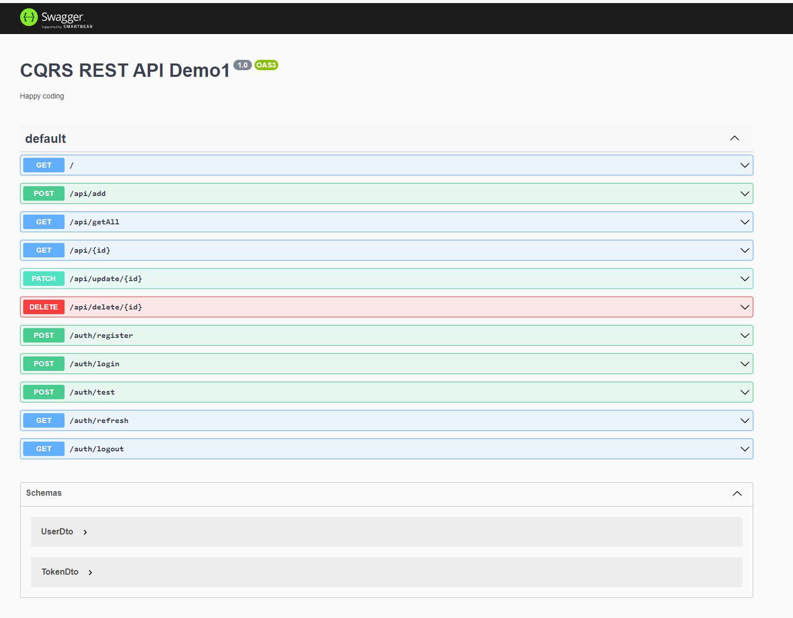

# CQRS

## CQRS Demo


## Communication in a microservice architecture

Between Microservices - Asynchronous messaging and event-driven communication are critical when propagating changes across multiple microservices and their related domain models.


In a microservice － Apply simplified CQRS and DDD patterns


## DDD

Domain-Driven Design - aims to ease the creation of complex applications by connecting the related pieces of the software into an ever-evolving model.

- Eases Communication
- Improves Flexibility
- Reduced Risk of Misunderstandings
- Good Software Architecture / Better Code


## What is CQRS?

CQRS is a concept that builds on Domain Driven Design (DDD).

CQRS pattern stands for Command and Query Responsibility Segregation.

CQRS separates reads and writes into different models, using commands to update data, and queries to read data.



## Why CQRS ?

Implementing CQRS in your application can maximize its performance, scalability, and security.

Benefits of CQRS include:

- Independent scaling. CQRS allows the read and write workloads to scale independently, and may result in fewer lock contentions.
- Optimized data schemas. The read side can use a schema that is optimized for queries, while the write side uses a schema that is optimized for updates.
- Security. It's easier to ensure that only the right domain entities are performing writes on the data.
- Separation of concerns. Segregating the read and write sides can result in models that are more maintainable and flexible. Most of the complex business logic goes into the write model. The read model can be relatively simple.
- Simpler queries. By storing a materialized view in the read database, the application can avoid complex joins when querying.

## How to CQRS ?

Nest - framework for Node.js based server-side applications. What problem does it solve? Architecture.

Nest provides an out-of-the-box application architecture that allows developers to create highly testable, scalable, loosely coupled, and easily maintainable applications.

CQRS

- Command - When a command is dispatched, the application reacts to it.Commands are consumed by Command Handlers.The Command Bus is a commands stream. It delegates commands to equivalent handlers.
- Query - a query that returns information via Query Handlers.
- Event - Asynchronous. They are dispatched by directly using EventBus.
- Saga - listen for 1..\* events.



Layer

- The Controllers layer handles HTTP requests and delegates tasks to the services layer.
- The Services layer is where most of the business logic lives.
- Use Repositories / DAOs to change / persist entities.
- Entities act as containers for the values, with setters and getters.

## CQRS Rest API Demo

## Installation

```bash
# install
$ npm install
```

## Running the app

```bash
# development
$ npm run start

# watch mode
$ npm run start:dev

# production mode
$ npm run start:prod
```

## Debug Mode

```bash
## debug mode - without db
$ yarn start:debug

## debug mode - with mongodb - first start mongo db in docker compose
$ yarn start:debug-mongo
```

## Test

```bash
# unit tests
$ npm run test

# e2e tests
$ npm run test:e2e

# test coverage
$ npm run test:cov
```

## Swagger

```bash
http://localhost:3000/swagger
```



## Test with MongoDB

```bash
# build mongodb and run with docker compose
$ docker compose up
# unit tests
$ yarn start:debug-mongo
```

[Back to DDD](./DDD.md)
