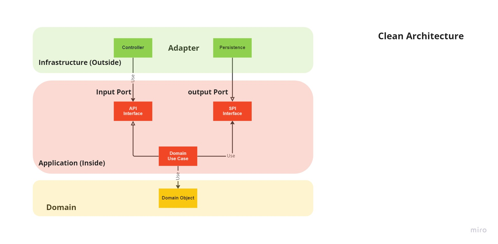

## CleanArchitecture

What is Bad Architecture

- Upgrade or migrating legacy system have to rewrite everything from scratch
- Had to redo the entire infrastructure.
- Tight coupling between each layer, No clean separation between the business logic and the technical code

## What is Clean Architecture.

Separation of responsibilities

- There are four layers in the diagram. Blue layer, Green layer, Red layer, and Yellow layer.

1.  Domain - Entities
    This will contain all entities, enums, exceptions, interfaces, types and logic specific to the domain layer.

2.  Application - Use Case
    This layer contains all application logic. It is dependent on the domain layer, but has no dependencies on any other layer or project. This layer defines interfaces that are implemented by outside layers. For example, if the application need to access a notification service, a new interface would be added to application and an implementation would be created within infrastructure.

3.  Infrastructure - Interface Adapters
    This layer contains classes for accessing external resources such as controller, gateways, presenters, file systems, web services, smtp, and so on. These classes should be based on interfaces defined within the application layer.

4.  Frameworks and Drivers
    Web, Database,Devices, External Interfaces

- The Dependency Rule
  states that the source code dependencies can only point inwards.

## Principle of Clean Architecture

1. Independent of any framework - be able to be applied to any system, regardless of the programming language or libraries it uses. The layers must be so well separated that they can survive individually, without the need for externals.

2. Testable -Each module, both UI, database, API Rest connection, etc., must be able to be tested individually.

3. Independent user interface (UI) - be able to change without disrupting the entire system.

4. Database independent - this layer must be so modular as to add multiple data sources and even multiple sources of the same type of data.

## Benefits

- Framework Independent – You can use clean architecture with ASP.NET (Core), Java, Javascript, Python, etc. It doesn’t rely on any software library or proprietary codebase.
- Database Independent - Majority of your code has no knowledge of what database, if any, is being used by the application. Often, this info will exist in a single class, in a single project that no other project references.
- UI Independent-The UI project cares about the UI only. It has nothing to do with the implementation of business or data logic.
- Highly Testable– Apps built using this approach, and especially the core domain model and its business rules, are extremely testable.

## Core

Separation of concerns: isolating the business logic

- Put all the business logic into a single place named the Application/Domain.
- The Application/domain depends on nothing but itself, everything is decoupled

## How to create Clean Architecture

1. Introduce interface for each layer
2. Move interface to Business Logic Layer (Dependency Inversion)
3. Dependency Changed, from outside to inside. Business logic should be no framework related.

## General Clean Architecture Flow:

- Inside: all the business logic (Ports, no frameworks, can be reused regardless of technical change)
- Outside: the infrastructure (Technical code, Adapters)
- Dependency go from outside toward the inside
- Business logic depends on nothing but itself. It must not depend on any technical framework.

- API - Application Provider Interface
- SPI - Service Provider Interface

## Demo Api.Gateway Clean Architecture:

## Benefits

- There is a real benefit in decoupling the business logic from the technical code. The domain is isolated because it depends on nothing.
- Write as many adapters as needed with a low impact on the rest of the software, the stack can be changed without any impact on the business.
- Focusing on the feature development, because only the feature brings value to your company.
- Delay choices on technical implementation to make the best choice at the right time.

# Steps to implement the clean architecture

## Always start with the inside

1. Focus on the feature. Because only the feature brings value to your company.
2. Delay choices on technical implementation.
3. Business Logic is a stand-alone.

## Finishing with the adapters

1. Controller Layer (query doamin)
2. Persistence Layer (domain receive/send to persistence)

[Back to README](../README.md)
