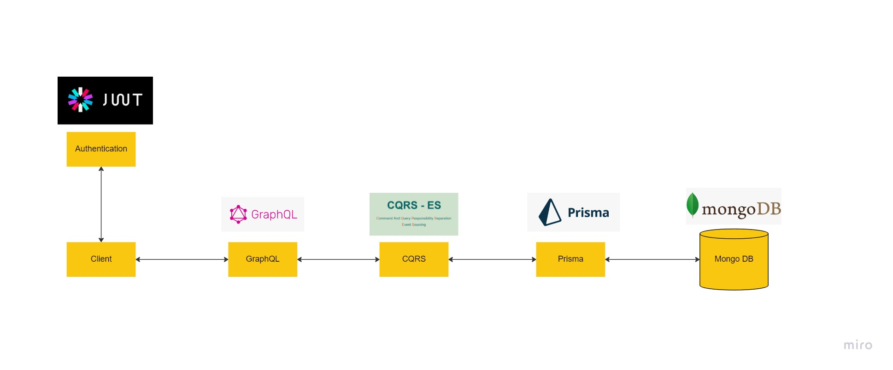

# Demo DDD Microservice Structure



- [x] Nest - Framework (Logger, Config, Middleware, DI, Decorator, ValidationPipe)
- [x] CQRS - DDD (Command, Query, Event, Saga, BaseCRUDQueryHandler, BaseCRUDQueryHandler)
- [x] Prisma - ORM (schema.prisma, PrismaService)
- [x] Mongo - DB (docker-compose.yaml, UsersMongoRepository)
- [x] GraphQL - Query (resolver, UsersResolver, AuthResolver)
- [x] Authentication - JWT (Guards, Strategy, ITokenService, IBcyptService)
- [x] Clean Architecture - (Domain, UseCase, Infrastructure)

## 1. NEST - Framework

[NEST](./NEST.md)

## 2. CQRS - DDD

[CQRS](./CQRS.md)

## 3. Prisma - ORM

[Prisma](./PRISMA.md)

## 4. Mongo -DB

[Mongo](./MONGO.md)

## 5. GraphQL - Query

[GraphQL](./GRAPHQL.md)

## 6. Authentication - JWT

[Authentication](./Authentication.md)

## Clean Architecture

[CleanArchitecure](./CleanArchitecture.md)

## 7. AWS - Lambda

[AWS](./AWS.md)

## 9. Debug Mode

```bash
## debug mode - without db
$ yarn start:debug

## debug mode - with mongodb - first start mongo db in docker compose
$ yarn start:debug-mongo
```

[Back to README](../README.md)
