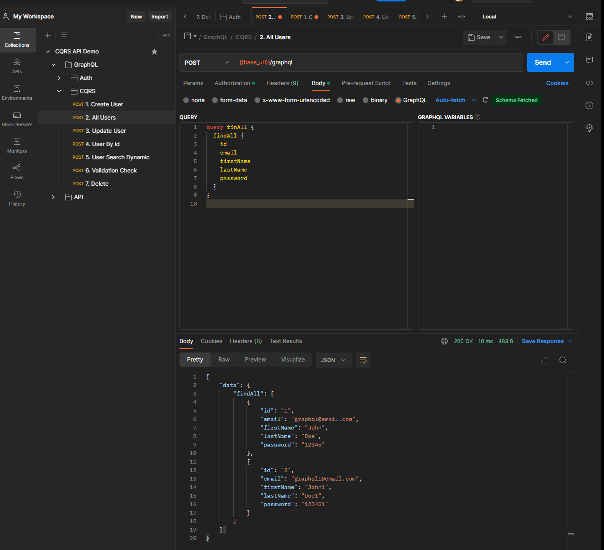
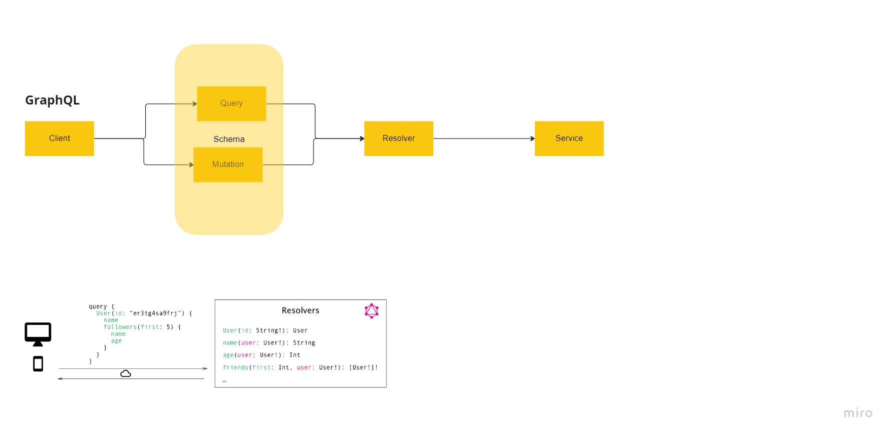
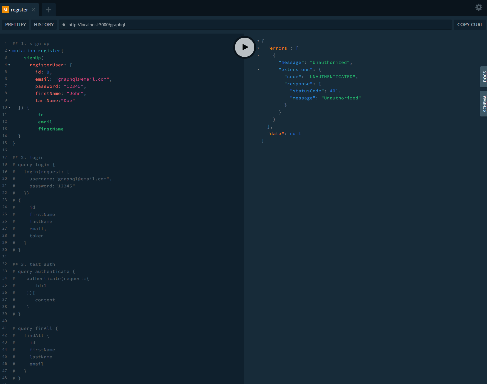

# GraphQL

GraphQL Demo



## GraphQL

What is GraphQL

GraphQL is a server-side runtime and query language for your API.
GraphQL is designed to make APIs fast, flexible, and developer-friendly.



Why GraphQL

- Strongly-typed Schema
- No Over-Fetching or Under-Fetching
- Saves Time and Bandwidth
- Versioning Is Not Required

How to use GraphQL

- Schema -GraphQL has its own type of language that’s used to write schemas. This is a human-readable schema syntax called Schema Definition Language (SDL).
- Types - Types are custom objects that represent how your API is going to look.
- Query - Queries in GraphQL are how you’re going to get data.
- Muation - Mutations are the way you’re going to modify data on the server and get updated data back.You can think like the CUD (Create, Update, Delete) of REST.
- Subscriptions - Subscriptions are the way you’re going to maintain a real-time connection with a server.

```bash
## adding graphql
$ npm i --save @nestjs/graphql @nestjs/apollo graphql-tools graphql apollo-server-express
```

### GraphQL Playground

http://localhost:3000/graphql



[Back to DDD](./DDD.md)
