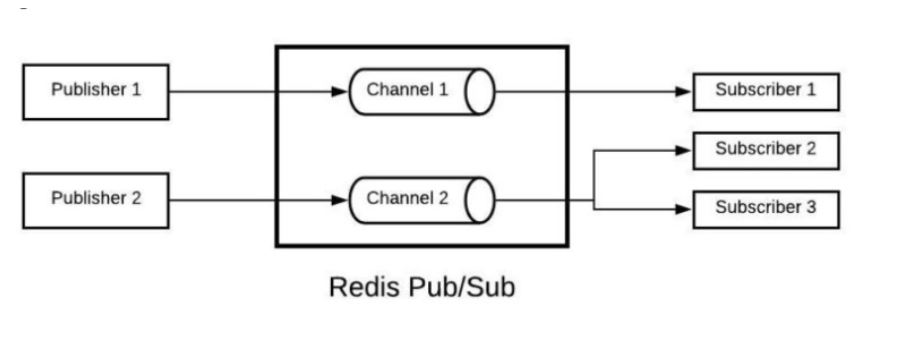

# API Gateway + Microservices


- [x] Nest - Framework (Logger, Config, Middleware, DI, Decorator, ValidationPipe)
- [x] API Gateway - apps/api.gateway (GRPC Client, REDIS Client, auth.redis.service.ts, user.grpc.service.ts)
- [x] Auth Mircroservice - apps/auth.microservice (Message Brokder [REDIS] Microservice, main.ts, auth.redis.controller.ts )
- [x] User Microserver - apps/user.microservice ( GRPC MicroService, users.proto, users.ts, main.ts, users.grpc.controller.ts)

## API Gateway - provides an extra layer, a single entry point lying between a group of microservices and the frontend layer/clients.


## Microservices Transporter

- The Redis transporter implements the publish/subscribe messaging paradigm and leverages the Pub/Sub feature of Redis
- MQTT (Message Queuing Telemetry Transport)
- NATS
- RabbitMQ
- Kafka
- gRPC is a modern, open source, high performance RPC framework that can run in any environment

## Message Brokder



- Producer –This component is responsible for sending messages. It’s connected to the message broker. In publish/subscribe pattern (We have discussed in the below section) they are called publishers.
- Consumer — This component consumes messages in the message broker. In publish/subscribe pattern they are called subscribers.
- Queue/topic — Message broker store messages here.

## GRPC


- gRPC is a high performance RPC framework/technology built by Google. gRPC offers up to 10x faster performance and API-security than REST+JSON communication as it uses Protobuf and HTTP/2.
- Protocol Buffers - which is an opensource message format for data serialization ,as the default method of communication between the client and the server. gRPC frameworks use protoc compiler to generate code from the .proto file.
- Streaming- A gRPC service supports different streaming combinations through HTTP/2
- HTTP/2 - over the TLS end-to-end encryption connection in gRPC ensures API security.

## 1. Install Microservices

```bash
## To start building microservices, first install the required package
$ npm i --save @nestjs/microservices
```

## 2. Setup Message Broker - Redis

```bash
## Install Redis server
$ sudo apt install redis-server

$ sudo nano /etc/redis/redis.conf
## Inside the file, find the supervised directive, change supervised no to supervised systemd

## Start the server
$ redis-server

## Test the server
$ sudo systemctl status redis

## Install Redis client in microservice
$ npm i --save ioredis

## start redis cli command
$ redis-cli

## check pub/sub message
$ monitor
```

## 3. Setup gRPC

```bash
## install gRPC
$ npm i --save @grpc/grpc-js @grpc/proto-loader

## install protobuf-compiler
$ sudo apt install protobuf-compiler

## install ts-proto
$ npm i -D ts-proto

## convert proto file to protobuf, run following protoc command under the root directory
$ protoc --plugin=node_modules/ts-proto/protoc-gen-ts_proto --ts_proto_out=. ./proto/users.proto --ts_proto_opt=outputEncodeMethods=false,outputJsonMethods=false,outputClientImpl=false,returnObservable=true

## or alternative, run ts_proto to generate interfaces, but this will needed further code change
$ npm i -g nestjs-proto-gen-ts
$ tsproto --path ./proto
```

## 4. Run API Gateway + Microservices

```bash
## 1. Install Redis server/MongoDB

## if prisma.user not found , run following command to recreate prisma client
$ npx prisma generate

## 2. Run users.microservice
$ yarn start-users:dev
## Or Run users.microservice in MongoDB
$ yarn start-users:dev-mongo

## 3. Run auth.microservice
$ yarn start-auth:dev
## or Run auth.microservice in MongoDB
$ yarn start-auth:dev-mongo

## 4. Run api.gateway
$ yarn start-api:dev

## 5. Debug api.gateway
$ yarn start-api:debug

## 6. Open Postman to test

```

[Back to README](../README.md)
