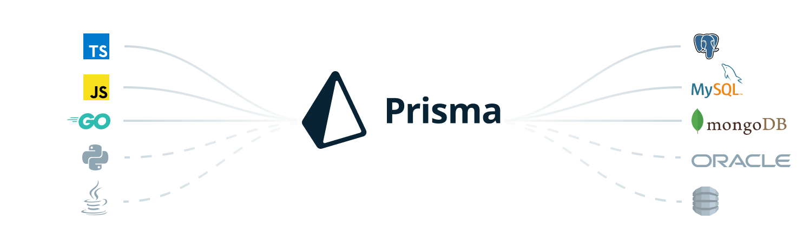

# Prisma



Prisma is an open-source ORM for Node.js and TypeScript. It is used as an alternative to writing plain SQL, or using another database access tool such as SQL query builders (like knex.js) or ORMs (like TypeORM and Sequelize). Prisma currently supports PostgreSQL, MySQL, SQL Server, SQLite, MongoDB and CockroachDB (Preview).

## 1. Set up Prisma

```bash
## set up prisma
$ npm i -g prisma
$ npm install prisma --save-dev
## init prisma
$ npx prisma
## will create /prisma/schema.prisma
$ npx prisma init
```

## 2. Set the database connection, Data modeling using Prisma

```bash
## create a new schema to config database
/prisma/schema.prisma
```

## 3. Install and generate Prisma Client


```bash
## install prisma client
$ npm install --save-dev @prisma/client
```

## 4. Execute the DB provider and set up prisma client

```bash
## Reads all above mentioned information from the Prisma schema to generate the correct data source client code (e.g. Prisma Client).
$ npx prisma generate
```

## 5. optional: Management of @unique indexes is realized through db push

```bash
## Reads the data sources and data model definition to create a new migration.
$ db push
```

[Back to DDD](./DDD.md)
