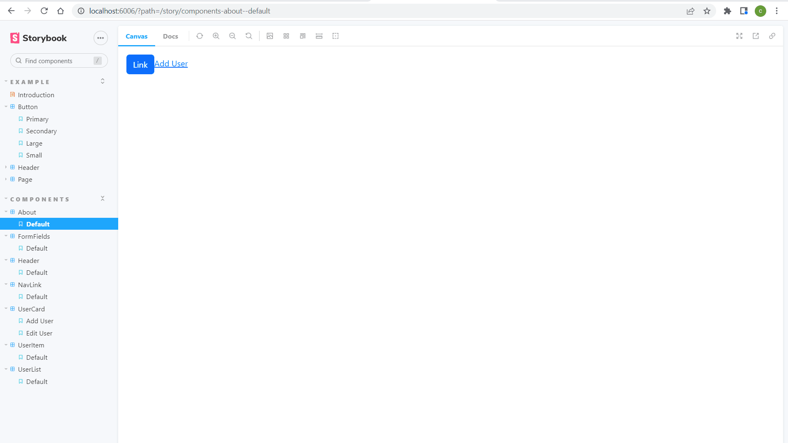

# NxDemo

$ nx g component PagedList --project=nextjs-client

## Authentication

- [x] Next Middleware (NextAuth [TODO])
- [x] Json-server


## Next Component

```bash
$ nx g component Login --project=nextjs-client

$ nx g component Signup --project=nextjs-client

## cookies

$ yarn add js-cookie

## graphql
$ yarn add graphql-request graphql

## react table
$ yarn add react-table
$ yarn add @tanstack/react-table
```

# NX

- Nx is a smart, fast and extensible build system with first class monorepo support and powerful integrations.



```bash
## install nx
$ yarn install -g nx

## Create nx workspace
$ npx create-nx-workspace@latest --packageManager=yarn

## Create nx plugin
yarn add -D @nrwl/react
yarn add -D @nrwl/angular
yarn add -D @nrwl/nest
yarn add -D @nrwl/next
yarn add -D @nrwl/express

## Create nx application
nx g @nrwl/nest:app reactapp
nx g @nrwl/nest:app nestapp

## nx test
nx test
## nx e2e
nx run client-e2e:e2e

## notify tools
$ yarn add react-toastify
```

# Docker

- Docker is an open source containerization platform.

```bash
Download Docker Desktop and install

$ sudo apt-get update
$ sudo apt install docker-compose
```

# Kubernetes

```bash
# kubectl - The Kubernetes command-line tool

## Install kubectl on Linux
## download latest
$ curl -LO "https://dl.k8s.io/release/$(curl -L -s https://dl.k8s.io/release/stable.txt)/bin/linux/amd64/kubectl"
## validate binary
$ curl -LO "https://dl.k8s.io/$(curl -L -s https://dl.k8s.io/release/stable.txt)/bin/linux/amd64/kubectl.sha256"
## Install kubectl
$ sudo apt-get update
$ sudo install -o root -g root -m 0755 kubectl /usr/local/bin/kubectl
## Test to ensure the version you installed is up-to-date:
$ kubectl version --client

# Check if minikube node is ready
$ kubectl get nodes

# minikube - minikube is local Kubernetes

# install the latest minikube stable release on x86-64 Linux using binary download
$ curl -LO https://storage.googleapis.com/minikube/releases/latest/minikube-linux-amd64

$ sudo install minikube-linux-amd64 /usr/local/bin/minikube

# Start your cluster
$ minikube start
# stop cluster
$ minikube stop
# delete cluster
$ minikube delete --all

# virtualbox - VirtualBox is a general-purpose full virtualizer for x86 hardware, targeted at server, desktop and embedded use.
$ sudo apt-get update
$ sudo apt-get install virtualbox
$ sudo apt-get install virtualbox—ext–pack

```

```bash
# 1. Create docker file

# 2. Start the kubernetes cluster with minikube
$ minikube start
$ minikube addons enable metrics-server

# 3. Check if minikube node is ready
$ kubectl get nodes

# 4. nx Build
$ nx build nestapp

# 5. Configure environment to use minikube’s Docker daemon
$ minikube docker-env

# 6. Copy and run the "eval" command from the output
$ eval $(minikube -p minikube docker-env)

# 7. Build the docker images
$ docker build -f ./apps/nestapp/Dockerfile . -t nestapp

# 8. Check whether docker images has been created
$ docker images --format "table {{.ID}}\t{{.Tag}}\t{{.Repository}}"

# 9. Create manifest config files
apps/nestapp/deployment.json
apps/nestapp/service.json

# 10. Apply the configuration in deployment.json and service.json to a pod
$ kubectl apply -f apps/nestapp/deployment.json
$ kubectl apply -f apps/nestapp/service.json

# 11. Check if pods are running
$ kubectl get pods

# 12. Check if services are running
$ kubectl get services

# 13. Access services outside the node
$ minikube service nestapp --url

# 14. http://127.0.0.1:xxxxx/api

# 15. minikube dashboard
$ minikube dashboard
```

<a href="https://nx.dev" target="_blank" rel="noreferrer"></a>

✨ **This workspace has been generated by [Nx, a Smart, fast and extensible build system.](https://nx.dev)** ✨

## Development server

Run `nx serve nextapp` for a dev server. Navigate to http://localhost:4200/. The app will automatically reload if you change any of the source files.

## Understand this workspace

Run `nx graph` to see a diagram of the dependencies of the projects.

## Remote caching

Run `npx nx connect-to-nx-cloud` to enable [remote caching](https://nx.app) and make CI faster.

## Further help

Visit the [Nx Documentation](https://nx.dev) to learn more.

[Back to README](../README.md)
